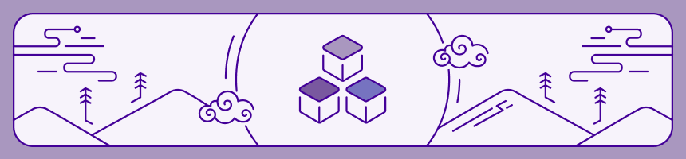

# Heroku Cloud Native Buildpacks
<p align="center">
  
</p>

## What are Heroku Cloud Native Buildpacks?

Heroku Cloud Native Buildpacks, now in preview, can help you create a production ready container image for your app with a single command, without the need to write a Dockerfile or configuring a complex build system.

Heroku Cloud Native Buildpacks implement the [Cloud Native Buildpacks specification](https://buildpacks.io/) (CNB) and are free and open-source software. They can be used independently of the Heroku platform.

### Philosophy

Heroku CNBs are written with the app developer in mind. We want it to be as easy and simple as possible to transform an app into an OCI image. Our buildpacks are highly opinionated and apply industry best-practices without requiring additional configuration.

## Table of contents

* [What are Heroku Buildpacks?](#what-are-heroku-cloud-native-buildpacks)
  * [Philosophy](#philosophy)
* [See it in action](#see-it-in-action)
  * [Prerequisites](#prerequisites)
    * [Docker](#docker)
    * [pack](#pack)
  * [Create the app image](#create-the-app-image)
  * [Tutorial](#tutorial)
* [Discussions](#discussions)
* [Supported Languages](#supported-languages)
* [Associated Projects](#associated-projects)
  * [libcnb.rs](#libcnbrs)
  * [Builder images](#builder-images)
  * [Procfile buildpack](#procfile-buildpack)

## See it in action

In this section we will use Heroku's Buildpacks to transform a Node.js app into a container image. The process for other languages is identical, you are encouraged to try it with your own app!

### Prerequisites

#### Docker
If you don't have it already, you need to install Docker. Refer to the Docker documentation on how to install it for your operating system: https://docs.docker.com/engine/install/

#### pack

To run our buildpack locally, we will use `pack`, a tool maintained by the Cloud Native Buildpacks project to support the use of buildpacks. Find their documentation about installing it here: https://buildpacks.io/docs/install-pack/

### Create the app image

First, we need an app to transform into an image. We use [Heroku's "getting started" app for Node.js](https://github.com/heroku/node-js-getting-started), but any other app that uses a supported ecosystem will work. We can clone the repository like so: `git clone https://github.com/heroku/node-js-getting-started.git`. 

Then, we can run the following command to build our app image - no additional steps needed! The required buildpacks for your app will be detected automatically.

```
pack build my-app-image --builder heroku/builder:22 --path node-js-getting-started
```

### Tutorial

Check out our [hands-on tutorial](TUTORIAL.md) to learn more about how our buildpacks can help you create production ready container images.

## Discussions

Overarching discussions about the Heroku Buildpacks project happen on GitHub in the [discussions tab of this repository](https://github.com/heroku/buildpacks/discussions). Feel free to open a new discussion if you have any questions, feedback or other input - we want to hear from you!

To view and report issues that are specific to a language ecosystem, see the issue tracker links in the ["Supported Languages" section](#supported-languages).  

## Supported Languages

Each supported ecosystem has its own Git repository where all related buildpacks are bundled. Language specific issues are tracked in their respective repositories.

| Name    | Repository                             | Issue Tracker           | Buildpack Registry                                                                               |
|---------|----------------------------------------|-------------------------|--------------------------------------------------------------------------------------------------|
| Go      | [buildpacks-go][go-repository]         | [Issues][go-issues]     | [![Cloud Native Buildpacks Registry: heroku/go][go-registry-badge]][go-registry-url]             |
| Java    | [buildpacks-jvm][jvm-repository]       | [Issues][jvm-issues]    | [![Cloud Native Buildpacks Registry: heroku/java][java-registry-badge]][java-registry-url]       |
| Node.js | [buildpacks-nodejs][nodejs-repository] | [Issues][nodejs-issues] | [![Cloud Native Buildpacks Registry: heroku/nodejs][nodejs-registry-badge]][nodejs-registry-url] |
| PHP     | [buildpacks-php][php-repository]       | [Issues][php-issues]    | [![Cloud Native Buildpacks Registry: heroku/php][php-registry-badge]][php-registry-url]          |
| Python  | [buildpacks-python][python-repository] | [Issues][python-issues] | [![Cloud Native Buildpacks Registry: heroku/python][python-registry-badge]][python-registry-url] |
| Ruby    | [buildpacks-ruby][ruby-repository]     | [Issues][ruby-issues]   | [![Cloud Native Buildpacks Registry: heroku/ruby][ruby-registry-badge]][ruby-registry-url]       |
| Scala   | [buildpacks-jvm][jvm-repository]       | [Issues][jvm-issues]    | [![Cloud Native Buildpacks Registry: heroku/scala][scala-registry-badge]][scala-registry-url]    |

## Associated Projects

### libcnb.rs

Heroku buildpacks are implemented in Rust. We developed and open-sourced a framework for writing Cloud Native Buildpacks in Rust called libcnb.rs.
You can find [the repository on GitHub](https://github.com/heroku/libcnb.rs).

### Builder Images

A CNB builder image is a packaged set of buildpacks, [base images](https://github.com/heroku/base-images) and a lifecycle binary that orchestrates the build process. You can find [Heroku's CNB Builder Images here](https://github.com/heroku/cnb-builder-images).

### Procfile Buildpack

Our Cloud Native Procfile Buildpack is available [here on GitHub as well](https://github.com/heroku/buildpacks-procfile).

[go-repository]: https://github.com/heroku/buildpacks-go
[jvm-repository]: https://github.com/heroku/buildpacks-jvm
[nodejs-repository]: https://github.com/heroku/buildpacks-nodejs
[php-repository]: https://github.com/heroku/buildpacks-php
[python-repository]: https://github.com/heroku/buildpacks-python
[ruby-repository]: https://github.com/heroku/buildpacks-ruby

[go-issues]: https://github.com/heroku/buildpacks-go/issues
[jvm-issues]: https://github.com/heroku/buildpacks-jvm/issues
[nodejs-issues]: https://github.com/heroku/buildpacks-nodejs/issues
[php-issues]: https://github.com/heroku/buildpacks-php/issues
[python-issues]: https://github.com/heroku/buildpacks-python/issues
[ruby-issues]: https://github.com/heroku/buildpacks-ruby/issues

[go-registry-badge]: https://img.shields.io/badge/dynamic/json?url=https://registry.buildpacks.io/api/v1/buildpacks/heroku/go&label=version&query=$.latest.version&color=DF0A6B&logo=data:image/png;base64,iVBORw0KGgoAAAANSUhEUgAAADAAAAAwCAYAAABXAvmHAAAAAXNSR0IArs4c6QAACSVJREFUaAXtWQ1sFMcVnp/9ub3zHT7AOEkNOMYYp4CQQFBLpY1TN05DidI2NSTF0CBFQAOBNrTlp0a14sipSBxIG6UYHKCO2ka4SXD4SUuaCqmoJJFMCapBtcGYGqMkDgQ4++52Z2e3b87es+/s+wNHVSUPsnZv9s2b97335v0MCI2NMQ2MaeD/WgP4FqQnX//2K4tVWfa0X+9+q/N4dfgWeESXPPjUUd+cu+5cYmMcPvzawQOtrdVG9GMaLxkD+OZDex6WVeUgwhiZnH1g62bNX4+sPpLGXvEkdPNzLd93e9y/cCnabIQJCnz+2Q9rNs9tjCdM9ltK9nGkb5jYxYjIyDJDSCLSV0yFHCr/XsObvQH92X+8u/b0SGvi5zZUn1joc/u2qapajglB4XAfUlQPoqpyRzxtqt8ZA+AIcQnZEb6WZSKCMSZUfSTLg8vv/86e3b03AztO/u3p7pE2fvInfy70TpiwRVKU5YqqygbTEWL9lISaiDFujbQu2VzGAIYzs5HFDUQo8WKibMzy0Yr7Ht5Td/Nyd0NLS3VQ0FesOjDurtwvPaWp6gZVc080TR2FQn0xrAgxkWVkLD8aBQD9cti2hWwAQimdImHpJTplcmXppF11hcV3Z/n92RsVVbuHc4bCod4YwZ0fHACYCCyS4Rg1AM6+ts2R+JOpNF/Okl/PyvLCeQc/j9O4Q+88hQWY/j+0gCOI84ycD0oRNxnSAVCqgYUFgDbTMeoWiBeAcRNRm8ZPD/uNCYfIZg6bTzXxxQKw4YCboH3SH7WSCRNxIQCb6fhiAYA0JgAgaQAQFhC0mY6MAYAzUIj9KN3jZoJbUEhWqQYBAJxZqX0tjlHGACyLtzKmM0pl2YKwmHzYcIjBt0kyuBhJVEKGHkKQ2DqT8xv+NWPEF9uOtOVNLz8B6XcqJVI+JGIIm4l8HCNVVSLfbctG8X9wOBDCFOl6+FRI19c07TvQjNDZRMyGSw8zGRdzUS7zVsnfyJtfSTHZLMlKkQ1lhUhmQ4cAl5XlgTwQu43IC4TK4PN6t8nMHR093bvOHPtZbGoeyijJeyznJISJPhWVvjAxL9u/VsZoHZGUif1u1a9EIbjLpQ4CgN/gegiE7uW2uffzgFV34tCK/yTinc78bQNwNllY9nKRy+feBE6xnEpS9HwoihwBQIgEGgdfs81mHjaeeeftJ/7prL2d56gBcIQoXfzbUpXKVUSWy8QcgQgkPMi0+IeQnZ899sYThxza0XiOOoABoQhUpJUypusRBFyO0W/ea/vLH1FrU0bd1mgAvD0ecNDRzGrl9pgkXB1RvlQw5dEyrKpVEI8+Ni19+6Xzr9+yby57sNrnK5y12u3xPhIOB8+d7mhbv//tTQaetmanROX5JueNXfzs7+7rPH7LffS1Rw9+zZvt34glktv3yaev4IIZK25CZPCKiAqVYx+yccONa589f/Xq4RG7qgT6ICtXv7ZU83i2ujXvLAQdmwiVXZyX/Lppn8Fo7ilnnW6xDwjnz+R31B915tJ53lj8++mu3JytxKVUSrIGCdiC8juMcNE9KyHmObkDkhKUwJZhdnHbqOvsC+xBVw5FuqpEmyxZtv+rvmzXNk3THsCQlETTIgaB7NojKSU7m/Zik+SeNAZyhCJobMjnNv8TENcWXKz/KBFvMX9uQe2EKQUz18kedb3syhrPuI6sgcQpwjQAeNyRPsrHBu1FLMLNFspYbXvHH96Mfhx4WbSorsh/5/hNbpdnmaIoqmnGnk8RNq/IVkl9czNi2P8+G5LkhPOq8J1Z7Aa37YZAyNg5p7vh8tA96tE8ecl3f7pc9bi3aJq3EGiRCTxwnLQjAnAY9QMRJbHdrKO+2sttTR/OXrjZ/+Wpdz8JGt+gaFqOaFjiM7BY3w/ALtl79OgwAA5/URSqYJGwbV6yLf58e+DC/gc+OdZ3/VsNZdTr3+bSXPfCfRFiSWqupACcjWxhdmYGFU19b9bsudO9Xl9xpHSwYksHh148oVYCC9gljcfeTQjAoZfA4hQEDXGjxZcz41PP5Mn3K5Is6dBjxyncWRJ9plWNYmgJIR+5PZrnIZeqpuxvBXcCFWiqWtWRQriGCZKCW81zQw8N1kDBkBFJgA5NomdaACKLoSnh0DGJsjdx9Tm4DQELhKAXEBukC0Sck7ARRrKhAgi45Rhkl/AtfQAWRCj4x5jw+dSssbAAzrzDEn0xNyAgpLGHQJU+ACC2QCsscmhTAxAuhFDm+cpm4oIrIwAiqKUWCIgghIEFBABoTlINASCE4arEphCsU1EPfhcWIGDlVBYQEgi2ElSJBqWSgofE6UF2sW8WCM5AOwJI8gE9M9g2GGTIJUnMsgkAEQ6Yah3IDQAsIzUAEbmEGJJlsqW2jZ+DEr4Y7m2TCicEMFOcAXF4xRkx9eAbNy+fORcIZzHDJb8KGz4Ot9lUhwiTbEQAJLEAFOeQOyQUNINdjIWrIsbNy6sYr2quH0HS+DFVlImYi01itSW0D/8vgLLHjR/2TQgkah8Ra8HFTjGOa06f3A797SCTCwWry8DSVXBvWhoJBgksLlM/3N6rw1xICOoCwXXOAlAU1tvBqzumdL18JcY7cwp+MH2cJG8CaVZgqPBE/HeG2FSWZCTi9NAhHFxkXYOzbpvznd2dZ3b19Bwf8Qb3AJqpLCgsrYRC6ecqJjMM4A+lxFB2SCbiLlWGucF5RXRzFgNK6yAzwzX551+MVswxABxOefmP3etS5a2YSuVizjkfBAo9l0tzyCDbSqKC7YUIu/daOFB3pbUxrf721B0rc/w+9zrYfK2K5QlhcCvnfFCigUr6L0ucDA3KeR8iYO3U8y8M6+ZGBDAgIc0vWl5BEakiijQTYmhkWpEVEBwOELgUt+y3QtysuXT21ahGoujSePl3/qpiRVK2wO3KY1ClyuJ8YHATcDPIyhQFud6JbfKr1vZz+xehd0a8e08GICKC318xzpejrpUQ3UAkaZK4yoGU/HduWts72hsPpyFnSpL2wjWlFNFfSoSWipqIWVYP1J27rwcCL839eF9PMgYpATiLJ01eOs2jaU+D03508cK/9iHUkm6F4LBI+hTlc9m0BSsVSufcCBkvzu7afSHpgrGPYxoY00BEA/8FOPrYBqYsE44AAAAASUVORK5CYII=&labelColor=white
[go-registry-url]: https://registry.buildpacks.io/buildpacks/heroku/go
[java-registry-badge]: https://img.shields.io/badge/dynamic/json?url=https://registry.buildpacks.io/api/v1/buildpacks/heroku/java&label=version&query=$.latest.version&color=DF0A6B&logo=data:image/png;base64,iVBORw0KGgoAAAANSUhEUgAAADAAAAAwCAYAAABXAvmHAAAAAXNSR0IArs4c6QAACSVJREFUaAXtWQ1sFMcVnp/9ub3zHT7AOEkNOMYYp4CQQFBLpY1TN05DidI2NSTF0CBFQAOBNrTlp0a14sipSBxIG6UYHKCO2ka4SXD4SUuaCqmoJJFMCapBtcGYGqMkDgQ4++52Z2e3b87es+/s+wNHVSUPsnZv9s2b97335v0MCI2NMQ2MaeD/WgP4FqQnX//2K4tVWfa0X+9+q/N4dfgWeESXPPjUUd+cu+5cYmMcPvzawQOtrdVG9GMaLxkD+OZDex6WVeUgwhiZnH1g62bNX4+sPpLGXvEkdPNzLd93e9y/cCnabIQJCnz+2Q9rNs9tjCdM9ltK9nGkb5jYxYjIyDJDSCLSV0yFHCr/XsObvQH92X+8u/b0SGvi5zZUn1joc/u2qapajglB4XAfUlQPoqpyRzxtqt8ZA+AIcQnZEb6WZSKCMSZUfSTLg8vv/86e3b03AztO/u3p7pE2fvInfy70TpiwRVKU5YqqygbTEWL9lISaiDFujbQu2VzGAIYzs5HFDUQo8WKibMzy0Yr7Ht5Td/Nyd0NLS3VQ0FesOjDurtwvPaWp6gZVc080TR2FQn0xrAgxkWVkLD8aBQD9cti2hWwAQimdImHpJTplcmXppF11hcV3Z/n92RsVVbuHc4bCod4YwZ0fHACYCCyS4Rg1AM6+ts2R+JOpNF/Okl/PyvLCeQc/j9O4Q+88hQWY/j+0gCOI84ycD0oRNxnSAVCqgYUFgDbTMeoWiBeAcRNRm8ZPD/uNCYfIZg6bTzXxxQKw4YCboH3SH7WSCRNxIQCb6fhiAYA0JgAgaQAQFhC0mY6MAYAzUIj9KN3jZoJbUEhWqQYBAJxZqX0tjlHGACyLtzKmM0pl2YKwmHzYcIjBt0kyuBhJVEKGHkKQ2DqT8xv+NWPEF9uOtOVNLz8B6XcqJVI+JGIIm4l8HCNVVSLfbctG8X9wOBDCFOl6+FRI19c07TvQjNDZRMyGSw8zGRdzUS7zVsnfyJtfSTHZLMlKkQ1lhUhmQ4cAl5XlgTwQu43IC4TK4PN6t8nMHR093bvOHPtZbGoeyijJeyznJISJPhWVvjAxL9u/VsZoHZGUif1u1a9EIbjLpQ4CgN/gegiE7uW2uffzgFV34tCK/yTinc78bQNwNllY9nKRy+feBE6xnEpS9HwoihwBQIgEGgdfs81mHjaeeeftJ/7prL2d56gBcIQoXfzbUpXKVUSWy8QcgQgkPMi0+IeQnZ899sYThxza0XiOOoABoQhUpJUypusRBFyO0W/ea/vLH1FrU0bd1mgAvD0ecNDRzGrl9pgkXB1RvlQw5dEyrKpVEI8+Ni19+6Xzr9+yby57sNrnK5y12u3xPhIOB8+d7mhbv//tTQaetmanROX5JueNXfzs7+7rPH7LffS1Rw9+zZvt34glktv3yaev4IIZK25CZPCKiAqVYx+yccONa589f/Xq4RG7qgT6ICtXv7ZU83i2ujXvLAQdmwiVXZyX/Lppn8Fo7ilnnW6xDwjnz+R31B915tJ53lj8++mu3JytxKVUSrIGCdiC8juMcNE9KyHmObkDkhKUwJZhdnHbqOvsC+xBVw5FuqpEmyxZtv+rvmzXNk3THsCQlETTIgaB7NojKSU7m/Zik+SeNAZyhCJobMjnNv8TENcWXKz/KBFvMX9uQe2EKQUz18kedb3syhrPuI6sgcQpwjQAeNyRPsrHBu1FLMLNFspYbXvHH96Mfhx4WbSorsh/5/hNbpdnmaIoqmnGnk8RNq/IVkl9czNi2P8+G5LkhPOq8J1Z7Aa37YZAyNg5p7vh8tA96tE8ecl3f7pc9bi3aJq3EGiRCTxwnLQjAnAY9QMRJbHdrKO+2sttTR/OXrjZ/+Wpdz8JGt+gaFqOaFjiM7BY3w/ALtl79OgwAA5/URSqYJGwbV6yLf58e+DC/gc+OdZ3/VsNZdTr3+bSXPfCfRFiSWqupACcjWxhdmYGFU19b9bsudO9Xl9xpHSwYksHh148oVYCC9gljcfeTQjAoZfA4hQEDXGjxZcz41PP5Mn3K5Is6dBjxyncWRJ9plWNYmgJIR+5PZrnIZeqpuxvBXcCFWiqWtWRQriGCZKCW81zQw8N1kDBkBFJgA5NomdaACKLoSnh0DGJsjdx9Tm4DQELhKAXEBukC0Sck7ARRrKhAgi45Rhkl/AtfQAWRCj4x5jw+dSssbAAzrzDEn0xNyAgpLGHQJU+ACC2QCsscmhTAxAuhFDm+cpm4oIrIwAiqKUWCIgghIEFBABoTlINASCE4arEphCsU1EPfhcWIGDlVBYQEgi2ElSJBqWSgofE6UF2sW8WCM5AOwJI8gE9M9g2GGTIJUnMsgkAEQ6Yah3IDQAsIzUAEbmEGJJlsqW2jZ+DEr4Y7m2TCicEMFOcAXF4xRkx9eAbNy+fORcIZzHDJb8KGz4Ot9lUhwiTbEQAJLEAFOeQOyQUNINdjIWrIsbNy6sYr2quH0HS+DFVlImYi01itSW0D/8vgLLHjR/2TQgkah8Ra8HFTjGOa06f3A797SCTCwWry8DSVXBvWhoJBgksLlM/3N6rw1xICOoCwXXOAlAU1tvBqzumdL18JcY7cwp+MH2cJG8CaVZgqPBE/HeG2FSWZCTi9NAhHFxkXYOzbpvznd2dZ3b19Bwf8Qb3AJqpLCgsrYRC6ecqJjMM4A+lxFB2SCbiLlWGucF5RXRzFgNK6yAzwzX551+MVswxABxOefmP3etS5a2YSuVizjkfBAo9l0tzyCDbSqKC7YUIu/daOFB3pbUxrf721B0rc/w+9zrYfK2K5QlhcCvnfFCigUr6L0ucDA3KeR8iYO3U8y8M6+ZGBDAgIc0vWl5BEakiijQTYmhkWpEVEBwOELgUt+y3QtysuXT21ahGoujSePl3/qpiRVK2wO3KY1ClyuJ8YHATcDPIyhQFud6JbfKr1vZz+xehd0a8e08GICKC318xzpejrpUQ3UAkaZK4yoGU/HduWts72hsPpyFnSpL2wjWlFNFfSoSWipqIWVYP1J27rwcCL839eF9PMgYpATiLJ01eOs2jaU+D03508cK/9iHUkm6F4LBI+hTlc9m0BSsVSufcCBkvzu7afSHpgrGPYxoY00BEA/8FOPrYBqYsE44AAAAASUVORK5CYII=&labelColor=white
[java-registry-url]: https://registry.buildpacks.io/buildpacks/heroku/java
[nodejs-registry-badge]: https://img.shields.io/badge/dynamic/json?url=https://registry.buildpacks.io/api/v1/buildpacks/heroku/nodejs&label=version&query=$.latest.version&color=DF0A6B&logo=data:image/png;base64,iVBORw0KGgoAAAANSUhEUgAAADAAAAAwCAYAAABXAvmHAAAAAXNSR0IArs4c6QAACSVJREFUaAXtWQ1sFMcVnp/9ub3zHT7AOEkNOMYYp4CQQFBLpY1TN05DidI2NSTF0CBFQAOBNrTlp0a14sipSBxIG6UYHKCO2ka4SXD4SUuaCqmoJJFMCapBtcGYGqMkDgQ4++52Z2e3b87es+/s+wNHVSUPsnZv9s2b97335v0MCI2NMQ2MaeD/WgP4FqQnX//2K4tVWfa0X+9+q/N4dfgWeESXPPjUUd+cu+5cYmMcPvzawQOtrdVG9GMaLxkD+OZDex6WVeUgwhiZnH1g62bNX4+sPpLGXvEkdPNzLd93e9y/cCnabIQJCnz+2Q9rNs9tjCdM9ltK9nGkb5jYxYjIyDJDSCLSV0yFHCr/XsObvQH92X+8u/b0SGvi5zZUn1joc/u2qapajglB4XAfUlQPoqpyRzxtqt8ZA+AIcQnZEb6WZSKCMSZUfSTLg8vv/86e3b03AztO/u3p7pE2fvInfy70TpiwRVKU5YqqygbTEWL9lISaiDFujbQu2VzGAIYzs5HFDUQo8WKibMzy0Yr7Ht5Td/Nyd0NLS3VQ0FesOjDurtwvPaWp6gZVc080TR2FQn0xrAgxkWVkLD8aBQD9cti2hWwAQimdImHpJTplcmXppF11hcV3Z/n92RsVVbuHc4bCod4YwZ0fHACYCCyS4Rg1AM6+ts2R+JOpNF/Okl/PyvLCeQc/j9O4Q+88hQWY/j+0gCOI84ycD0oRNxnSAVCqgYUFgDbTMeoWiBeAcRNRm8ZPD/uNCYfIZg6bTzXxxQKw4YCboH3SH7WSCRNxIQCb6fhiAYA0JgAgaQAQFhC0mY6MAYAzUIj9KN3jZoJbUEhWqQYBAJxZqX0tjlHGACyLtzKmM0pl2YKwmHzYcIjBt0kyuBhJVEKGHkKQ2DqT8xv+NWPEF9uOtOVNLz8B6XcqJVI+JGIIm4l8HCNVVSLfbctG8X9wOBDCFOl6+FRI19c07TvQjNDZRMyGSw8zGRdzUS7zVsnfyJtfSTHZLMlKkQ1lhUhmQ4cAl5XlgTwQu43IC4TK4PN6t8nMHR093bvOHPtZbGoeyijJeyznJISJPhWVvjAxL9u/VsZoHZGUif1u1a9EIbjLpQ4CgN/gegiE7uW2uffzgFV34tCK/yTinc78bQNwNllY9nKRy+feBE6xnEpS9HwoihwBQIgEGgdfs81mHjaeeeftJ/7prL2d56gBcIQoXfzbUpXKVUSWy8QcgQgkPMi0+IeQnZ899sYThxza0XiOOoABoQhUpJUypusRBFyO0W/ea/vLH1FrU0bd1mgAvD0ecNDRzGrl9pgkXB1RvlQw5dEyrKpVEI8+Ni19+6Xzr9+yby57sNrnK5y12u3xPhIOB8+d7mhbv//tTQaetmanROX5JueNXfzs7+7rPH7LffS1Rw9+zZvt34glktv3yaev4IIZK25CZPCKiAqVYx+yccONa589f/Xq4RG7qgT6ICtXv7ZU83i2ujXvLAQdmwiVXZyX/Lppn8Fo7ilnnW6xDwjnz+R31B915tJ53lj8++mu3JytxKVUSrIGCdiC8juMcNE9KyHmObkDkhKUwJZhdnHbqOvsC+xBVw5FuqpEmyxZtv+rvmzXNk3THsCQlETTIgaB7NojKSU7m/Zik+SeNAZyhCJobMjnNv8TENcWXKz/KBFvMX9uQe2EKQUz18kedb3syhrPuI6sgcQpwjQAeNyRPsrHBu1FLMLNFspYbXvHH96Mfhx4WbSorsh/5/hNbpdnmaIoqmnGnk8RNq/IVkl9czNi2P8+G5LkhPOq8J1Z7Aa37YZAyNg5p7vh8tA96tE8ecl3f7pc9bi3aJq3EGiRCTxwnLQjAnAY9QMRJbHdrKO+2sttTR/OXrjZ/+Wpdz8JGt+gaFqOaFjiM7BY3w/ALtl79OgwAA5/URSqYJGwbV6yLf58e+DC/gc+OdZ3/VsNZdTr3+bSXPfCfRFiSWqupACcjWxhdmYGFU19b9bsudO9Xl9xpHSwYksHh148oVYCC9gljcfeTQjAoZfA4hQEDXGjxZcz41PP5Mn3K5Is6dBjxyncWRJ9plWNYmgJIR+5PZrnIZeqpuxvBXcCFWiqWtWRQriGCZKCW81zQw8N1kDBkBFJgA5NomdaACKLoSnh0DGJsjdx9Tm4DQELhKAXEBukC0Sck7ARRrKhAgi45Rhkl/AtfQAWRCj4x5jw+dSssbAAzrzDEn0xNyAgpLGHQJU+ACC2QCsscmhTAxAuhFDm+cpm4oIrIwAiqKUWCIgghIEFBABoTlINASCE4arEphCsU1EPfhcWIGDlVBYQEgi2ElSJBqWSgofE6UF2sW8WCM5AOwJI8gE9M9g2GGTIJUnMsgkAEQ6Yah3IDQAsIzUAEbmEGJJlsqW2jZ+DEr4Y7m2TCicEMFOcAXF4xRkx9eAbNy+fORcIZzHDJb8KGz4Ot9lUhwiTbEQAJLEAFOeQOyQUNINdjIWrIsbNy6sYr2quH0HS+DFVlImYi01itSW0D/8vgLLHjR/2TQgkah8Ra8HFTjGOa06f3A797SCTCwWry8DSVXBvWhoJBgksLlM/3N6rw1xICOoCwXXOAlAU1tvBqzumdL18JcY7cwp+MH2cJG8CaVZgqPBE/HeG2FSWZCTi9NAhHFxkXYOzbpvznd2dZ3b19Bwf8Qb3AJqpLCgsrYRC6ecqJjMM4A+lxFB2SCbiLlWGucF5RXRzFgNK6yAzwzX551+MVswxABxOefmP3etS5a2YSuVizjkfBAo9l0tzyCDbSqKC7YUIu/daOFB3pbUxrf721B0rc/w+9zrYfK2K5QlhcCvnfFCigUr6L0ucDA3KeR8iYO3U8y8M6+ZGBDAgIc0vWl5BEakiijQTYmhkWpEVEBwOELgUt+y3QtysuXT21ahGoujSePl3/qpiRVK2wO3KY1ClyuJ8YHATcDPIyhQFud6JbfKr1vZz+xehd0a8e08GICKC318xzpejrpUQ3UAkaZK4yoGU/HduWts72hsPpyFnSpL2wjWlFNFfSoSWipqIWVYP1J27rwcCL839eF9PMgYpATiLJ01eOs2jaU+D03508cK/9iHUkm6F4LBI+hTlc9m0BSsVSufcCBkvzu7afSHpgrGPYxoY00BEA/8FOPrYBqYsE44AAAAASUVORK5CYII=&labelColor=white
[nodejs-registry-url]: https://registry.buildpacks.io/buildpacks/heroku/nodejs
[php-registry-badge]: https://img.shields.io/badge/dynamic/json?url=https://registry.buildpacks.io/api/v1/buildpacks/heroku/php&label=version&query=$.latest.version&color=DF0A6B&logo=data:image/png;base64,iVBORw0KGgoAAAANSUhEUgAAADAAAAAwCAYAAABXAvmHAAAAAXNSR0IArs4c6QAACSVJREFUaAXtWQ1sFMcVnp/9ub3zHT7AOEkNOMYYp4CQQFBLpY1TN05DidI2NSTF0CBFQAOBNrTlp0a14sipSBxIG6UYHKCO2ka4SXD4SUuaCqmoJJFMCapBtcGYGqMkDgQ4++52Z2e3b87es+/s+wNHVSUPsnZv9s2b97335v0MCI2NMQ2MaeD/WgP4FqQnX//2K4tVWfa0X+9+q/N4dfgWeESXPPjUUd+cu+5cYmMcPvzawQOtrdVG9GMaLxkD+OZDex6WVeUgwhiZnH1g62bNX4+sPpLGXvEkdPNzLd93e9y/cCnabIQJCnz+2Q9rNs9tjCdM9ltK9nGkb5jYxYjIyDJDSCLSV0yFHCr/XsObvQH92X+8u/b0SGvi5zZUn1joc/u2qapajglB4XAfUlQPoqpyRzxtqt8ZA+AIcQnZEb6WZSKCMSZUfSTLg8vv/86e3b03AztO/u3p7pE2fvInfy70TpiwRVKU5YqqygbTEWL9lISaiDFujbQu2VzGAIYzs5HFDUQo8WKibMzy0Yr7Ht5Td/Nyd0NLS3VQ0FesOjDurtwvPaWp6gZVc080TR2FQn0xrAgxkWVkLD8aBQD9cti2hWwAQimdImHpJTplcmXppF11hcV3Z/n92RsVVbuHc4bCod4YwZ0fHACYCCyS4Rg1AM6+ts2R+JOpNF/Okl/PyvLCeQc/j9O4Q+88hQWY/j+0gCOI84ycD0oRNxnSAVCqgYUFgDbTMeoWiBeAcRNRm8ZPD/uNCYfIZg6bTzXxxQKw4YCboH3SH7WSCRNxIQCb6fhiAYA0JgAgaQAQFhC0mY6MAYAzUIj9KN3jZoJbUEhWqQYBAJxZqX0tjlHGACyLtzKmM0pl2YKwmHzYcIjBt0kyuBhJVEKGHkKQ2DqT8xv+NWPEF9uOtOVNLz8B6XcqJVI+JGIIm4l8HCNVVSLfbctG8X9wOBDCFOl6+FRI19c07TvQjNDZRMyGSw8zGRdzUS7zVsnfyJtfSTHZLMlKkQ1lhUhmQ4cAl5XlgTwQu43IC4TK4PN6t8nMHR093bvOHPtZbGoeyijJeyznJISJPhWVvjAxL9u/VsZoHZGUif1u1a9EIbjLpQ4CgN/gegiE7uW2uffzgFV34tCK/yTinc78bQNwNllY9nKRy+feBE6xnEpS9HwoihwBQIgEGgdfs81mHjaeeeftJ/7prL2d56gBcIQoXfzbUpXKVUSWy8QcgQgkPMi0+IeQnZ899sYThxza0XiOOoABoQhUpJUypusRBFyO0W/ea/vLH1FrU0bd1mgAvD0ecNDRzGrl9pgkXB1RvlQw5dEyrKpVEI8+Ni19+6Xzr9+yby57sNrnK5y12u3xPhIOB8+d7mhbv//tTQaetmanROX5JueNXfzs7+7rPH7LffS1Rw9+zZvt34glktv3yaev4IIZK25CZPCKiAqVYx+yccONa589f/Xq4RG7qgT6ICtXv7ZU83i2ujXvLAQdmwiVXZyX/Lppn8Fo7ilnnW6xDwjnz+R31B915tJ53lj8++mu3JytxKVUSrIGCdiC8juMcNE9KyHmObkDkhKUwJZhdnHbqOvsC+xBVw5FuqpEmyxZtv+rvmzXNk3THsCQlETTIgaB7NojKSU7m/Zik+SeNAZyhCJobMjnNv8TENcWXKz/KBFvMX9uQe2EKQUz18kedb3syhrPuI6sgcQpwjQAeNyRPsrHBu1FLMLNFspYbXvHH96Mfhx4WbSorsh/5/hNbpdnmaIoqmnGnk8RNq/IVkl9czNi2P8+G5LkhPOq8J1Z7Aa37YZAyNg5p7vh8tA96tE8ecl3f7pc9bi3aJq3EGiRCTxwnLQjAnAY9QMRJbHdrKO+2sttTR/OXrjZ/+Wpdz8JGt+gaFqOaFjiM7BY3w/ALtl79OgwAA5/URSqYJGwbV6yLf58e+DC/gc+OdZ3/VsNZdTr3+bSXPfCfRFiSWqupACcjWxhdmYGFU19b9bsudO9Xl9xpHSwYksHh148oVYCC9gljcfeTQjAoZfA4hQEDXGjxZcz41PP5Mn3K5Is6dBjxyncWRJ9plWNYmgJIR+5PZrnIZeqpuxvBXcCFWiqWtWRQriGCZKCW81zQw8N1kDBkBFJgA5NomdaACKLoSnh0DGJsjdx9Tm4DQELhKAXEBukC0Sck7ARRrKhAgi45Rhkl/AtfQAWRCj4x5jw+dSssbAAzrzDEn0xNyAgpLGHQJU+ACC2QCsscmhTAxAuhFDm+cpm4oIrIwAiqKUWCIgghIEFBABoTlINASCE4arEphCsU1EPfhcWIGDlVBYQEgi2ElSJBqWSgofE6UF2sW8WCM5AOwJI8gE9M9g2GGTIJUnMsgkAEQ6Yah3IDQAsIzUAEbmEGJJlsqW2jZ+DEr4Y7m2TCicEMFOcAXF4xRkx9eAbNy+fORcIZzHDJb8KGz4Ot9lUhwiTbEQAJLEAFOeQOyQUNINdjIWrIsbNy6sYr2quH0HS+DFVlImYi01itSW0D/8vgLLHjR/2TQgkah8Ra8HFTjGOa06f3A797SCTCwWry8DSVXBvWhoJBgksLlM/3N6rw1xICOoCwXXOAlAU1tvBqzumdL18JcY7cwp+MH2cJG8CaVZgqPBE/HeG2FSWZCTi9NAhHFxkXYOzbpvznd2dZ3b19Bwf8Qb3AJqpLCgsrYRC6ecqJjMM4A+lxFB2SCbiLlWGucF5RXRzFgNK6yAzwzX551+MVswxABxOefmP3etS5a2YSuVizjkfBAo9l0tzyCDbSqKC7YUIu/daOFB3pbUxrf721B0rc/w+9zrYfK2K5QlhcCvnfFCigUr6L0ucDA3KeR8iYO3U8y8M6+ZGBDAgIc0vWl5BEakiijQTYmhkWpEVEBwOELgUt+y3QtysuXT21ahGoujSePl3/qpiRVK2wO3KY1ClyuJ8YHATcDPIyhQFud6JbfKr1vZz+xehd0a8e08GICKC318xzpejrpUQ3UAkaZK4yoGU/HduWts72hsPpyFnSpL2wjWlFNFfSoSWipqIWVYP1J27rwcCL839eF9PMgYpATiLJ01eOs2jaU+D03508cK/9iHUkm6F4LBI+hTlc9m0BSsVSufcCBkvzu7afSHpgrGPYxoY00BEA/8FOPrYBqYsE44AAAAASUVORK5CYII=&labelColor=white
[php-registry-url]: https://registry.buildpacks.io/buildpacks/heroku/php
[python-registry-badge]: https://img.shields.io/badge/dynamic/json?url=https://registry.buildpacks.io/api/v1/buildpacks/heroku/python&label=version&query=$.latest.version&color=DF0A6B&logo=data:image/png;base64,iVBORw0KGgoAAAANSUhEUgAAADAAAAAwCAYAAABXAvmHAAAAAXNSR0IArs4c6QAACSVJREFUaAXtWQ1sFMcVnp/9ub3zHT7AOEkNOMYYp4CQQFBLpY1TN05DidI2NSTF0CBFQAOBNrTlp0a14sipSBxIG6UYHKCO2ka4SXD4SUuaCqmoJJFMCapBtcGYGqMkDgQ4++52Z2e3b87es+/s+wNHVSUPsnZv9s2b97335v0MCI2NMQ2MaeD/WgP4FqQnX//2K4tVWfa0X+9+q/N4dfgWeESXPPjUUd+cu+5cYmMcPvzawQOtrdVG9GMaLxkD+OZDex6WVeUgwhiZnH1g62bNX4+sPpLGXvEkdPNzLd93e9y/cCnabIQJCnz+2Q9rNs9tjCdM9ltK9nGkb5jYxYjIyDJDSCLSV0yFHCr/XsObvQH92X+8u/b0SGvi5zZUn1joc/u2qapajglB4XAfUlQPoqpyRzxtqt8ZA+AIcQnZEb6WZSKCMSZUfSTLg8vv/86e3b03AztO/u3p7pE2fvInfy70TpiwRVKU5YqqygbTEWL9lISaiDFujbQu2VzGAIYzs5HFDUQo8WKibMzy0Yr7Ht5Td/Nyd0NLS3VQ0FesOjDurtwvPaWp6gZVc080TR2FQn0xrAgxkWVkLD8aBQD9cti2hWwAQimdImHpJTplcmXppF11hcV3Z/n92RsVVbuHc4bCod4YwZ0fHACYCCyS4Rg1AM6+ts2R+JOpNF/Okl/PyvLCeQc/j9O4Q+88hQWY/j+0gCOI84ycD0oRNxnSAVCqgYUFgDbTMeoWiBeAcRNRm8ZPD/uNCYfIZg6bTzXxxQKw4YCboH3SH7WSCRNxIQCb6fhiAYA0JgAgaQAQFhC0mY6MAYAzUIj9KN3jZoJbUEhWqQYBAJxZqX0tjlHGACyLtzKmM0pl2YKwmHzYcIjBt0kyuBhJVEKGHkKQ2DqT8xv+NWPEF9uOtOVNLz8B6XcqJVI+JGIIm4l8HCNVVSLfbctG8X9wOBDCFOl6+FRI19c07TvQjNDZRMyGSw8zGRdzUS7zVsnfyJtfSTHZLMlKkQ1lhUhmQ4cAl5XlgTwQu43IC4TK4PN6t8nMHR093bvOHPtZbGoeyijJeyznJISJPhWVvjAxL9u/VsZoHZGUif1u1a9EIbjLpQ4CgN/gegiE7uW2uffzgFV34tCK/yTinc78bQNwNllY9nKRy+feBE6xnEpS9HwoihwBQIgEGgdfs81mHjaeeeftJ/7prL2d56gBcIQoXfzbUpXKVUSWy8QcgQgkPMi0+IeQnZ899sYThxza0XiOOoABoQhUpJUypusRBFyO0W/ea/vLH1FrU0bd1mgAvD0ecNDRzGrl9pgkXB1RvlQw5dEyrKpVEI8+Ni19+6Xzr9+yby57sNrnK5y12u3xPhIOB8+d7mhbv//tTQaetmanROX5JueNXfzs7+7rPH7LffS1Rw9+zZvt34glktv3yaev4IIZK25CZPCKiAqVYx+yccONa589f/Xq4RG7qgT6ICtXv7ZU83i2ujXvLAQdmwiVXZyX/Lppn8Fo7ilnnW6xDwjnz+R31B915tJ53lj8++mu3JytxKVUSrIGCdiC8juMcNE9KyHmObkDkhKUwJZhdnHbqOvsC+xBVw5FuqpEmyxZtv+rvmzXNk3THsCQlETTIgaB7NojKSU7m/Zik+SeNAZyhCJobMjnNv8TENcWXKz/KBFvMX9uQe2EKQUz18kedb3syhrPuI6sgcQpwjQAeNyRPsrHBu1FLMLNFspYbXvHH96Mfhx4WbSorsh/5/hNbpdnmaIoqmnGnk8RNq/IVkl9czNi2P8+G5LkhPOq8J1Z7Aa37YZAyNg5p7vh8tA96tE8ecl3f7pc9bi3aJq3EGiRCTxwnLQjAnAY9QMRJbHdrKO+2sttTR/OXrjZ/+Wpdz8JGt+gaFqOaFjiM7BY3w/ALtl79OgwAA5/URSqYJGwbV6yLf58e+DC/gc+OdZ3/VsNZdTr3+bSXPfCfRFiSWqupACcjWxhdmYGFU19b9bsudO9Xl9xpHSwYksHh148oVYCC9gljcfeTQjAoZfA4hQEDXGjxZcz41PP5Mn3K5Is6dBjxyncWRJ9plWNYmgJIR+5PZrnIZeqpuxvBXcCFWiqWtWRQriGCZKCW81zQw8N1kDBkBFJgA5NomdaACKLoSnh0DGJsjdx9Tm4DQELhKAXEBukC0Sck7ARRrKhAgi45Rhkl/AtfQAWRCj4x5jw+dSssbAAzrzDEn0xNyAgpLGHQJU+ACC2QCsscmhTAxAuhFDm+cpm4oIrIwAiqKUWCIgghIEFBABoTlINASCE4arEphCsU1EPfhcWIGDlVBYQEgi2ElSJBqWSgofE6UF2sW8WCM5AOwJI8gE9M9g2GGTIJUnMsgkAEQ6Yah3IDQAsIzUAEbmEGJJlsqW2jZ+DEr4Y7m2TCicEMFOcAXF4xRkx9eAbNy+fORcIZzHDJb8KGz4Ot9lUhwiTbEQAJLEAFOeQOyQUNINdjIWrIsbNy6sYr2quH0HS+DFVlImYi01itSW0D/8vgLLHjR/2TQgkah8Ra8HFTjGOa06f3A797SCTCwWry8DSVXBvWhoJBgksLlM/3N6rw1xICOoCwXXOAlAU1tvBqzumdL18JcY7cwp+MH2cJG8CaVZgqPBE/HeG2FSWZCTi9NAhHFxkXYOzbpvznd2dZ3b19Bwf8Qb3AJqpLCgsrYRC6ecqJjMM4A+lxFB2SCbiLlWGucF5RXRzFgNK6yAzwzX551+MVswxABxOefmP3etS5a2YSuVizjkfBAo9l0tzyCDbSqKC7YUIu/daOFB3pbUxrf721B0rc/w+9zrYfK2K5QlhcCvnfFCigUr6L0ucDA3KeR8iYO3U8y8M6+ZGBDAgIc0vWl5BEakiijQTYmhkWpEVEBwOELgUt+y3QtysuXT21ahGoujSePl3/qpiRVK2wO3KY1ClyuJ8YHATcDPIyhQFud6JbfKr1vZz+xehd0a8e08GICKC318xzpejrpUQ3UAkaZK4yoGU/HduWts72hsPpyFnSpL2wjWlFNFfSoSWipqIWVYP1J27rwcCL839eF9PMgYpATiLJ01eOs2jaU+D03508cK/9iHUkm6F4LBI+hTlc9m0BSsVSufcCBkvzu7afSHpgrGPYxoY00BEA/8FOPrYBqYsE44AAAAASUVORK5CYII=&labelColor=white
[python-registry-url]: https://registry.buildpacks.io/buildpacks/heroku/python
[ruby-registry-badge]: https://img.shields.io/badge/dynamic/json?url=https://registry.buildpacks.io/api/v1/buildpacks/heroku/ruby&label=version&query=$.latest.version&color=DF0A6B&logo=data:image/png;base64,iVBORw0KGgoAAAANSUhEUgAAADAAAAAwCAYAAABXAvmHAAAAAXNSR0IArs4c6QAACSVJREFUaAXtWQ1sFMcVnp/9ub3zHT7AOEkNOMYYp4CQQFBLpY1TN05DidI2NSTF0CBFQAOBNrTlp0a14sipSBxIG6UYHKCO2ka4SXD4SUuaCqmoJJFMCapBtcGYGqMkDgQ4++52Z2e3b87es+/s+wNHVSUPsnZv9s2b97335v0MCI2NMQ2MaeD/WgP4FqQnX//2K4tVWfa0X+9+q/N4dfgWeESXPPjUUd+cu+5cYmMcPvzawQOtrdVG9GMaLxkD+OZDex6WVeUgwhiZnH1g62bNX4+sPpLGXvEkdPNzLd93e9y/cCnabIQJCnz+2Q9rNs9tjCdM9ltK9nGkb5jYxYjIyDJDSCLSV0yFHCr/XsObvQH92X+8u/b0SGvi5zZUn1joc/u2qapajglB4XAfUlQPoqpyRzxtqt8ZA+AIcQnZEb6WZSKCMSZUfSTLg8vv/86e3b03AztO/u3p7pE2fvInfy70TpiwRVKU5YqqygbTEWL9lISaiDFujbQu2VzGAIYzs5HFDUQo8WKibMzy0Yr7Ht5Td/Nyd0NLS3VQ0FesOjDurtwvPaWp6gZVc080TR2FQn0xrAgxkWVkLD8aBQD9cti2hWwAQimdImHpJTplcmXppF11hcV3Z/n92RsVVbuHc4bCod4YwZ0fHACYCCyS4Rg1AM6+ts2R+JOpNF/Okl/PyvLCeQc/j9O4Q+88hQWY/j+0gCOI84ycD0oRNxnSAVCqgYUFgDbTMeoWiBeAcRNRm8ZPD/uNCYfIZg6bTzXxxQKw4YCboH3SH7WSCRNxIQCb6fhiAYA0JgAgaQAQFhC0mY6MAYAzUIj9KN3jZoJbUEhWqQYBAJxZqX0tjlHGACyLtzKmM0pl2YKwmHzYcIjBt0kyuBhJVEKGHkKQ2DqT8xv+NWPEF9uOtOVNLz8B6XcqJVI+JGIIm4l8HCNVVSLfbctG8X9wOBDCFOl6+FRI19c07TvQjNDZRMyGSw8zGRdzUS7zVsnfyJtfSTHZLMlKkQ1lhUhmQ4cAl5XlgTwQu43IC4TK4PN6t8nMHR093bvOHPtZbGoeyijJeyznJISJPhWVvjAxL9u/VsZoHZGUif1u1a9EIbjLpQ4CgN/gegiE7uW2uffzgFV34tCK/yTinc78bQNwNllY9nKRy+feBE6xnEpS9HwoihwBQIgEGgdfs81mHjaeeeftJ/7prL2d56gBcIQoXfzbUpXKVUSWy8QcgQgkPMi0+IeQnZ899sYThxza0XiOOoABoQhUpJUypusRBFyO0W/ea/vLH1FrU0bd1mgAvD0ecNDRzGrl9pgkXB1RvlQw5dEyrKpVEI8+Ni19+6Xzr9+yby57sNrnK5y12u3xPhIOB8+d7mhbv//tTQaetmanROX5JueNXfzs7+7rPH7LffS1Rw9+zZvt34glktv3yaev4IIZK25CZPCKiAqVYx+yccONa589f/Xq4RG7qgT6ICtXv7ZU83i2ujXvLAQdmwiVXZyX/Lppn8Fo7ilnnW6xDwjnz+R31B915tJ53lj8++mu3JytxKVUSrIGCdiC8juMcNE9KyHmObkDkhKUwJZhdnHbqOvsC+xBVw5FuqpEmyxZtv+rvmzXNk3THsCQlETTIgaB7NojKSU7m/Zik+SeNAZyhCJobMjnNv8TENcWXKz/KBFvMX9uQe2EKQUz18kedb3syhrPuI6sgcQpwjQAeNyRPsrHBu1FLMLNFspYbXvHH96Mfhx4WbSorsh/5/hNbpdnmaIoqmnGnk8RNq/IVkl9czNi2P8+G5LkhPOq8J1Z7Aa37YZAyNg5p7vh8tA96tE8ecl3f7pc9bi3aJq3EGiRCTxwnLQjAnAY9QMRJbHdrKO+2sttTR/OXrjZ/+Wpdz8JGt+gaFqOaFjiM7BY3w/ALtl79OgwAA5/URSqYJGwbV6yLf58e+DC/gc+OdZ3/VsNZdTr3+bSXPfCfRFiSWqupACcjWxhdmYGFU19b9bsudO9Xl9xpHSwYksHh148oVYCC9gljcfeTQjAoZfA4hQEDXGjxZcz41PP5Mn3K5Is6dBjxyncWRJ9plWNYmgJIR+5PZrnIZeqpuxvBXcCFWiqWtWRQriGCZKCW81zQw8N1kDBkBFJgA5NomdaACKLoSnh0DGJsjdx9Tm4DQELhKAXEBukC0Sck7ARRrKhAgi45Rhkl/AtfQAWRCj4x5jw+dSssbAAzrzDEn0xNyAgpLGHQJU+ACC2QCsscmhTAxAuhFDm+cpm4oIrIwAiqKUWCIgghIEFBABoTlINASCE4arEphCsU1EPfhcWIGDlVBYQEgi2ElSJBqWSgofE6UF2sW8WCM5AOwJI8gE9M9g2GGTIJUnMsgkAEQ6Yah3IDQAsIzUAEbmEGJJlsqW2jZ+DEr4Y7m2TCicEMFOcAXF4xRkx9eAbNy+fORcIZzHDJb8KGz4Ot9lUhwiTbEQAJLEAFOeQOyQUNINdjIWrIsbNy6sYr2quH0HS+DFVlImYi01itSW0D/8vgLLHjR/2TQgkah8Ra8HFTjGOa06f3A797SCTCwWry8DSVXBvWhoJBgksLlM/3N6rw1xICOoCwXXOAlAU1tvBqzumdL18JcY7cwp+MH2cJG8CaVZgqPBE/HeG2FSWZCTi9NAhHFxkXYOzbpvznd2dZ3b19Bwf8Qb3AJqpLCgsrYRC6ecqJjMM4A+lxFB2SCbiLlWGucF5RXRzFgNK6yAzwzX551+MVswxABxOefmP3etS5a2YSuVizjkfBAo9l0tzyCDbSqKC7YUIu/daOFB3pbUxrf721B0rc/w+9zrYfK2K5QlhcCvnfFCigUr6L0ucDA3KeR8iYO3U8y8M6+ZGBDAgIc0vWl5BEakiijQTYmhkWpEVEBwOELgUt+y3QtysuXT21ahGoujSePl3/qpiRVK2wO3KY1ClyuJ8YHATcDPIyhQFud6JbfKr1vZz+xehd0a8e08GICKC318xzpejrpUQ3UAkaZK4yoGU/HduWts72hsPpyFnSpL2wjWlFNFfSoSWipqIWVYP1J27rwcCL839eF9PMgYpATiLJ01eOs2jaU+D03508cK/9iHUkm6F4LBI+hTlc9m0BSsVSufcCBkvzu7afSHpgrGPYxoY00BEA/8FOPrYBqYsE44AAAAASUVORK5CYII=&labelColor=white
[ruby-registry-url]: https://registry.buildpacks.io/buildpacks/heroku/ruby
[scala-registry-badge]: https://img.shields.io/badge/dynamic/json?url=https://registry.buildpacks.io/api/v1/buildpacks/heroku/scala&label=version&query=$.latest.version&color=DF0A6B&logo=data:image/png;base64,iVBORw0KGgoAAAANSUhEUgAAADAAAAAwCAYAAABXAvmHAAAAAXNSR0IArs4c6QAACSVJREFUaAXtWQ1sFMcVnp/9ub3zHT7AOEkNOMYYp4CQQFBLpY1TN05DidI2NSTF0CBFQAOBNrTlp0a14sipSBxIG6UYHKCO2ka4SXD4SUuaCqmoJJFMCapBtcGYGqMkDgQ4++52Z2e3b87es+/s+wNHVSUPsnZv9s2b97335v0MCI2NMQ2MaeD/WgP4FqQnX//2K4tVWfa0X+9+q/N4dfgWeESXPPjUUd+cu+5cYmMcPvzawQOtrdVG9GMaLxkD+OZDex6WVeUgwhiZnH1g62bNX4+sPpLGXvEkdPNzLd93e9y/cCnabIQJCnz+2Q9rNs9tjCdM9ltK9nGkb5jYxYjIyDJDSCLSV0yFHCr/XsObvQH92X+8u/b0SGvi5zZUn1joc/u2qapajglB4XAfUlQPoqpyRzxtqt8ZA+AIcQnZEb6WZSKCMSZUfSTLg8vv/86e3b03AztO/u3p7pE2fvInfy70TpiwRVKU5YqqygbTEWL9lISaiDFujbQu2VzGAIYzs5HFDUQo8WKibMzy0Yr7Ht5Td/Nyd0NLS3VQ0FesOjDurtwvPaWp6gZVc080TR2FQn0xrAgxkWVkLD8aBQD9cti2hWwAQimdImHpJTplcmXppF11hcV3Z/n92RsVVbuHc4bCod4YwZ0fHACYCCyS4Rg1AM6+ts2R+JOpNF/Okl/PyvLCeQc/j9O4Q+88hQWY/j+0gCOI84ycD0oRNxnSAVCqgYUFgDbTMeoWiBeAcRNRm8ZPD/uNCYfIZg6bTzXxxQKw4YCboH3SH7WSCRNxIQCb6fhiAYA0JgAgaQAQFhC0mY6MAYAzUIj9KN3jZoJbUEhWqQYBAJxZqX0tjlHGACyLtzKmM0pl2YKwmHzYcIjBt0kyuBhJVEKGHkKQ2DqT8xv+NWPEF9uOtOVNLz8B6XcqJVI+JGIIm4l8HCNVVSLfbctG8X9wOBDCFOl6+FRI19c07TvQjNDZRMyGSw8zGRdzUS7zVsnfyJtfSTHZLMlKkQ1lhUhmQ4cAl5XlgTwQu43IC4TK4PN6t8nMHR093bvOHPtZbGoeyijJeyznJISJPhWVvjAxL9u/VsZoHZGUif1u1a9EIbjLpQ4CgN/gegiE7uW2uffzgFV34tCK/yTinc78bQNwNllY9nKRy+feBE6xnEpS9HwoihwBQIgEGgdfs81mHjaeeeftJ/7prL2d56gBcIQoXfzbUpXKVUSWy8QcgQgkPMi0+IeQnZ899sYThxza0XiOOoABoQhUpJUypusRBFyO0W/ea/vLH1FrU0bd1mgAvD0ecNDRzGrl9pgkXB1RvlQw5dEyrKpVEI8+Ni19+6Xzr9+yby57sNrnK5y12u3xPhIOB8+d7mhbv//tTQaetmanROX5JueNXfzs7+7rPH7LffS1Rw9+zZvt34glktv3yaev4IIZK25CZPCKiAqVYx+yccONa589f/Xq4RG7qgT6ICtXv7ZU83i2ujXvLAQdmwiVXZyX/Lppn8Fo7ilnnW6xDwjnz+R31B915tJ53lj8++mu3JytxKVUSrIGCdiC8juMcNE9KyHmObkDkhKUwJZhdnHbqOvsC+xBVw5FuqpEmyxZtv+rvmzXNk3THsCQlETTIgaB7NojKSU7m/Zik+SeNAZyhCJobMjnNv8TENcWXKz/KBFvMX9uQe2EKQUz18kedb3syhrPuI6sgcQpwjQAeNyRPsrHBu1FLMLNFspYbXvHH96Mfhx4WbSorsh/5/hNbpdnmaIoqmnGnk8RNq/IVkl9czNi2P8+G5LkhPOq8J1Z7Aa37YZAyNg5p7vh8tA96tE8ecl3f7pc9bi3aJq3EGiRCTxwnLQjAnAY9QMRJbHdrKO+2sttTR/OXrjZ/+Wpdz8JGt+gaFqOaFjiM7BY3w/ALtl79OgwAA5/URSqYJGwbV6yLf58e+DC/gc+OdZ3/VsNZdTr3+bSXPfCfRFiSWqupACcjWxhdmYGFU19b9bsudO9Xl9xpHSwYksHh148oVYCC9gljcfeTQjAoZfA4hQEDXGjxZcz41PP5Mn3K5Is6dBjxyncWRJ9plWNYmgJIR+5PZrnIZeqpuxvBXcCFWiqWtWRQriGCZKCW81zQw8N1kDBkBFJgA5NomdaACKLoSnh0DGJsjdx9Tm4DQELhKAXEBukC0Sck7ARRrKhAgi45Rhkl/AtfQAWRCj4x5jw+dSssbAAzrzDEn0xNyAgpLGHQJU+ACC2QCsscmhTAxAuhFDm+cpm4oIrIwAiqKUWCIgghIEFBABoTlINASCE4arEphCsU1EPfhcWIGDlVBYQEgi2ElSJBqWSgofE6UF2sW8WCM5AOwJI8gE9M9g2GGTIJUnMsgkAEQ6Yah3IDQAsIzUAEbmEGJJlsqW2jZ+DEr4Y7m2TCicEMFOcAXF4xRkx9eAbNy+fORcIZzHDJb8KGz4Ot9lUhwiTbEQAJLEAFOeQOyQUNINdjIWrIsbNy6sYr2quH0HS+DFVlImYi01itSW0D/8vgLLHjR/2TQgkah8Ra8HFTjGOa06f3A797SCTCwWry8DSVXBvWhoJBgksLlM/3N6rw1xICOoCwXXOAlAU1tvBqzumdL18JcY7cwp+MH2cJG8CaVZgqPBE/HeG2FSWZCTi9NAhHFxkXYOzbpvznd2dZ3b19Bwf8Qb3AJqpLCgsrYRC6ecqJjMM4A+lxFB2SCbiLlWGucF5RXRzFgNK6yAzwzX551+MVswxABxOefmP3etS5a2YSuVizjkfBAo9l0tzyCDbSqKC7YUIu/daOFB3pbUxrf721B0rc/w+9zrYfK2K5QlhcCvnfFCigUr6L0ucDA3KeR8iYO3U8y8M6+ZGBDAgIc0vWl5BEakiijQTYmhkWpEVEBwOELgUt+y3QtysuXT21ahGoujSePl3/qpiRVK2wO3KY1ClyuJ8YHATcDPIyhQFud6JbfKr1vZz+xehd0a8e08GICKC318xzpejrpUQ3UAkaZK4yoGU/HduWts72hsPpyFnSpL2wjWlFNFfSoSWipqIWVYP1J27rwcCL839eF9PMgYpATiLJ01eOs2jaU+D03508cK/9iHUkm6F4LBI+hTlc9m0BSsVSufcCBkvzu7afSHpgrGPYxoY00BEA/8FOPrYBqYsE44AAAAASUVORK5CYII=&labelColor=white
[scala-registry-url]: https://registry.buildpacks.io/buildpacks/heroku/scala
