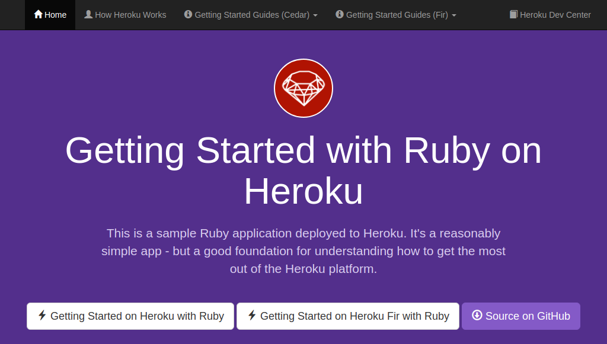

<!-- STOP
  This file was generated by a rundoc script, do not modify it.

  Instead modify the rundoc script and re-run it.

  Command: /home/runner/work/buildpacks/buildpacks/.rundoc-workspace/vendor/bundle/ruby/3.3.0/bin/rundoc ../docs/src/ruby/ruby_tutorial.md
STOP -->
# Heroku Ruby Cloud Native Buildpack (CNB) Tutorial

Build a Ruby on Rails application image in 5 minutes, no Dockerfile required.

At the end of this tutorial, you'll have a working [OCI image](https://opencontainers.org/) of a Ruby on Rails application that can run locally. You will learn about the Cloud Native Buildpack (CNB) ecosystem, and how to utilize the [pack CLI](https://buildpacks.io/docs/for-platform-operators/how-to/integrate-ci/pack/) to build images without the need to write or maintain a Dockerfile.

## Install the pack CLI

We assume you have [docker installed](https://docs.docker.com/engine/install/) and a working copy [of git](https://github.com/git-guides/install-git). Next, you will need to install the CLI tool for building CNBs, [pack CLI](https://buildpacks.io/docs/for-platform-operators/how-to/integrate-ci/pack/). If you're on a Mac you can install it via Homebrew:

```
$ brew install buildpacks/tap/pack
```
<!-- STOP. This document is autogenerated. Do not manually modify. See the top of the doc for more details. -->

Ensure that `pack` is installed correctly:

```
$ pack --version
0.35.1+git-3a22a7f.build-6099
```
<!-- STOP. This document is autogenerated. Do not manually modify. See the top of the doc for more details. -->

## Configure the default pack builder

Once `pack` is installed, the only configuration you'll need for this tutorial is to set a default builder:

```
$ pack config default-builder heroku/builder:24
Builder 'heroku/builder:24' is now the default builder
```
<!-- STOP. This document is autogenerated. Do not manually modify. See the top of the doc for more details. -->

You can view your default builder at any time:

```
$ pack config default-builder
The current default builder is 'heroku/builder:24'
```
<!-- STOP. This document is autogenerated. Do not manually modify. See the top of the doc for more details. -->

> Note: The `heroku/builder:24` supports both amd64 (also known as x86) and arm64 (such as aarch64 used with newer Mac machines) architectures. If needed, you can configure the architecture for `docker` and `pack` CLIs using the `--platform` argument if needed. For example `--platform linux/amd64`.

## What is a builder?

> [!NOTE]
> Skip ahead if you want to build the application first and get into the details later. You won't need to
> know about builders for the rest of this tutorial.

In short, a builder is a delivery mechanism for buildpacks. A builder contains references to base images and individual buildpacks. A base image contains the operating system and system dependencies. Buildpacks are the components that will configure an image to run your application, that’s where the bulk of the logic lives and why the project is called “Cloud Native Buildpacks” and not “Cloud Native Builders.”

You can view the contents of a builder via the command `pack builder inspect`. For example:

```
$ pack builder inspect heroku/builder:24 | grep Buildpacks: -m1 -A10
Buildpacks:
  ID                                NAME                               VERSION        HOMEPAGE
  heroku/deb-packages               Heroku .deb Packages               0.0.3          https://github.com/heroku/buildpacks-deb-packages
  heroku/dotnet                     Heroku .NET                        0.1.9          https://github.com/heroku/buildpacks-dotnet
  heroku/go                         Heroku Go                          0.5.0          https://github.com/heroku/buildpacks-go
  heroku/gradle                     Heroku Gradle                      6.0.4          https://github.com/heroku/buildpacks-jvm
  heroku/java                       Heroku Java                        6.0.4          https://github.com/heroku/buildpacks-jvm
  heroku/jvm                        Heroku OpenJDK                     6.0.4          https://github.com/heroku/buildpacks-jvm
  heroku/maven                      Heroku Maven                       6.0.4          https://github.com/heroku/buildpacks-jvm
  heroku/nodejs                     Heroku Node.js                     3.4.0          https://github.com/heroku/buildpacks-nodejs
  heroku/nodejs-corepack            Heroku Node.js Corepack            3.4.0          https://github.com/heroku/buildpacks-nodejs
```
<!-- STOP. This document is autogenerated. Do not manually modify. See the top of the doc for more details. -->

> [!NOTE]
> Your output version numbers may differ.

This output shows the various buildpacks that represent the different languages that are supported by this builder such as `heroku/go` and `heroku/nodejs-engine`.

## Download an example Ruby on Rails application

How do you configure a CNB? Give them an application. While Dockerfile is procedural, buildpacks, are declarative. A buildpack will determine what your application needs to function by inspecting the code on disk.

For this example, we're using a pre-built Ruby on Rails application. Download it now:

```
$ git clone https://github.com/heroku/ruby-getting-started
$ cd ruby-getting-started
```
<!-- STOP. This document is autogenerated. Do not manually modify. See the top of the doc for more details. -->

Verify you're in the correct directory:

```
$ ls
Gemfile
Gemfile.lock
Procfile
README.md
Rakefile
app
app.json
bin
config
config.ru
db
lib
log
package.json
public
test
vendor
```
<!-- STOP. This document is autogenerated. Do not manually modify. See the top of the doc for more details. -->

This tutorial was built using the following commit SHA:

```
$ git log --oneline | head -n1
5e7ce01 Remove link (#171)
```
<!-- STOP. This document is autogenerated. Do not manually modify. See the top of the doc for more details. -->

## Build the application image with the pack CLI

Now build an image named `my-image-name` by executing the heroku builder against the application by running the
`pack build` command:

```
$ pack build my-image-name --path .
===> ANALYZING
Image with name "my-image-name" not found
===> DETECTING
3 of 6 buildpacks participating
heroku/nodejs-engine 3.4.0
heroku/ruby          4.0.1
heroku/procfile      3.1.2
===> RESTORING
Skipping buildpack layer analysis
===> BUILDING

[Heroku Node.js Engine Buildpack]

[Checking Node.js version]
Node.js version not specified, using 22.x
Resolved Node.js version: 22.12.0

[Installing Node.js distribution]
Downloading Node.js 22.12.0 (linux-amd64) from https://nodejs.org/download/release/v22.12.0/node-v22.12.0-linux-x64.tar.gz
Verifying checksum
Extracting Node.js 22.12.0 (linux-amd64)
Installing Node.js 22.12.0 (linux-amd64)
Installing application metrics scripts

## Heroku Ruby Buildpack

- Metrics agent
  - Skipping install (`barnes` gem not found)
- Ruby version `3.2.4` from `Gemfile.lock`
  - Installing ...
- Bundler version `2.5.9` from `Gemfile.lock`
  - Running `gem install bundler --version 2.5.9` ...
- Bundle install gems
  - Running `BUNDLE_BIN="/layers/heroku_ruby/gems/bin" BUNDLE_CLEAN="1" BUNDLE_DEPLOYMENT="1" BUNDLE_GEMFILE="/workspace/Gemfile" BUNDLE_PATH="/layers/heroku_ruby/gems" BUNDLE_WITHOUT="development:test" bundle install`

      Gems in the groups 'development' and 'test' were not installed.
      Bundled gems are installed into `/layers/heroku_ruby/gems`

  - Done
- Default process detection
  - Running `bundle list` ...
  - Detected rails app (`rails` gem found)
- Rake assets install
  - Detected rake (`rake` gem found, `Rakefile` found at `/workspace/Rakefile`)
  - Running `bundle exec rake -P --trace` ...
  - Compiling assets with cache (detected `rake assets:precompile` and `rake assets:clean` via `bundle exec rake -P`)
  - Creating cache for /workspace/public/assets
  - Creating cache for /workspace/tmp/cache/assets
  - Running `bundle exec rake assets:precompile assets:clean --trace`

      ** Invoke assets:precompile (first_time)
      ** Invoke assets:environment (first_time)
      ** Execute assets:environment
      ** Invoke environment (first_time)
      ** Execute environment
      ** Execute assets:precompile
      ** Invoke assets:clean (first_time)
      ** Invoke assets:environment 
      ** Execute assets:clean

  - Done
  - Storing cache for /workspace/public/assets
  - Storing cache for /workspace/tmp/cache/assets
- Done

[Discovering process types]
Procfile declares types -> web
===> EXPORTING
Adding layer 'heroku/nodejs-engine:dist'
Adding layer 'heroku/nodejs-engine:node_runtime_metrics'
Adding layer 'heroku/nodejs-engine:web_env'
Adding layer 'heroku/ruby:bundler'
Adding layer 'heroku/ruby:cache_public_assets'
Adding layer 'heroku/ruby:cache_tmp_cache_assets'
Adding layer 'heroku/ruby:env_defaults'
Adding layer 'heroku/ruby:gems'
Adding layer 'heroku/ruby:ruby'
Adding layer 'buildpacksio/lifecycle:launch.sbom'
Added 1/1 app layer(s)
Adding layer 'buildpacksio/lifecycle:launcher'
Adding layer 'buildpacksio/lifecycle:config'
Adding layer 'buildpacksio/lifecycle:process-types'
Adding label 'io.buildpacks.lifecycle.metadata'
Adding label 'io.buildpacks.build.metadata'
Adding label 'io.buildpacks.project.metadata'
Setting default process type 'web'
Saving my-image-name...
*** Images (abcdef012345):
      my-image-name
Adding cache layer 'heroku/nodejs-engine:dist'
Adding cache layer 'heroku/ruby:bundler'
Adding cache layer 'heroku/ruby:cache_public_assets'
Adding cache layer 'heroku/ruby:cache_tmp_cache_assets'
Adding cache layer 'heroku/ruby:gems'
Adding cache layer 'heroku/ruby:ruby'
Successfully built image 'my-image-name'
```
<!-- STOP. This document is autogenerated. Do not manually modify. See the top of the doc for more details. -->

> [!NOTE]
> Your output may differ.

Verify that you see “Successfully built image my-image-name” at the end of the output. And verify that the image is present locally:

```
$ docker image ls --format "table {{.ID}}\t{{.Repository}}\t{{.Tag}}" | grep my-image-name
abcdef012345   my-image-name    latest
```
<!-- STOP. This document is autogenerated. Do not manually modify. See the top of the doc for more details. -->

## What does `pack build` do?

> [!NOTE]
> Skip ahead if you want to run the application first and get into the details later.

When you run `pack build` with a builder, each buildpack runs a detection script to determine if it should be eligible to build the application. In our case the `heroku/ruby` buildpack found a `Gemfile.lock` file and `heroku/nodejs-engine` buildpack found a `package.json` file on disk. As a result, both buildpacks have enough information to install Ruby and Node dependencies. You can view a list of the buildpacks used in the output above:


```
===> DETECTING
3 of 6 buildpacks participating
heroku/nodejs-engine 3.4.0
heroku/ruby          4.0.1
heroku/procfile      3.1.2
===> RESTORING
```
<!-- STOP. This document is autogenerated. Do not manually modify. See the top of the doc for more details. -->

After the detect phase, each buildpack will execute. Buildpacks can inspect your project, install files to disk, run commands, write environment variables, [and more](https://buildpacks.io/docs/for-buildpack-authors/). You can see some examples of that in the output above. For example, the Ruby buildpack installs dependencies from the `Gemfile` automatically:

```
  - Running `BUNDLE_BIN="/layers/heroku_ruby/gems/bin" BUNDLE_CLEAN="1" BUNDLE_DEPLOYMENT="1" BUNDLE_GEMFILE="/workspace/Gemfile" BUNDLE_PATH="/layers/heroku_ruby/gems" BUNDLE_WITHOUT="development:test" bundle install`
```
<!-- STOP. This document is autogenerated. Do not manually modify. See the top of the doc for more details. -->

If you’re familiar with Dockerfile you might know that [many commands in a Dockerfile will create a layer](https://dockerlabs.collabnix.com/beginners/dockerfile/Layering-Dockerfile.html). Buildpacks also use layers, but the CNB buildpack API provides for fine grained control over what exactly is in these layers and how they’re composed. Unlike Dockerfile, all images produced by CNBs [can be rebased](https://tag-env-sustainability.cncf.io/blog/2023-12-reduce-reuse-rebase-buildpacks/#reduce-reuserebase). The CNB api also improves on many of the pitfalls outlined in the satirical article [Write a Good Dockerfile in 19 'Easy' Steps](https://jkutner.github.io/2021/04/26/write-good-dockerfile.html).

## Use the image

Even though we used `pack` and CNBs to build our image, it can be run with your favorite tools like any other OCI image. We will be using the `docker` command line to run our image.

By default, images will be booted into a web server configuration. You can launch the app we just built by running:

```
$ docker run -it --rm --env PORT=9292 -p 9292:9292 my-image-name
[1] Puma starting in cluster mode...
[1] * Puma version: 6.4.2 (ruby 3.2.4-p170) ("The Eagle of Durango")
[1] *  Min threads: 5
[1] *  Max threads: 5
[1] *  Environment: production
[1] *   Master PID: 1
[1] *      Workers: 1
[1] *     Restarts: (✔) hot (✖) phased
[1] * Preloading application
[1] * Listening on http://[::]:9292
[1] Use Ctrl-C to stop
[1] ! WARNING: Detected running cluster mode with 1 worker.
[1] ! Running Puma in cluster mode with a single worker is often a misconfiguration.
[1] ! Consider running Puma in single-mode (workers = 0) in order to reduce memory overhead.
[1] ! Set the `silence_single_worker_warning` option to silence this warning message.
[1] - Worker 0 (PID: 15) booted in 0.0s, phase: 0
```
<!-- STOP. This document is autogenerated. Do not manually modify. See the top of the doc for more details. -->

Now when you visit [http://localhost:9292](http://localhost:9292) you should see a working web application:



Don't forget to stop the docker container when you're done.


Here's a quick breakdown of that command we just ran:

- `docker run` Create and run a new container from an image.
- `-it` Makes the container interactive and allocates a TTY.
- `--rm` Automatically remove the container when it exits.
- `--env PORT=9292` Creates an environment variable named `PORT` and sets it to `9292` this is needed so the application inside the container knows what port to bind the web server.
- `-p 9292:9292` Publishes a container's port(s) to the host. This is what allows requests from your machine to be received by the container.
- `my-image-name` The name of the image you want to use for the application.

So far, we've downloaded an application via git and run a single command `pack build` to generate an image, and then we can use that image as if it was generated via a Dockerfile via the `docker run` command.

In addition to running the image as a web server, you can access the container's terminal interactively. In a new terminal window try running this command:

```
$ docker run -it --rm my-image-name bash
```
<!-- STOP. This document is autogenerated. Do not manually modify. See the top of the doc for more details. -->

Now you can inspect the container interactively. For example, you can see the files on disk with `ls`:

```
$ ls
Gemfile
Gemfile.lock
Procfile
README.md
Rakefile
app
app.json
bin
build_output.txt
config
config.ru
db
lib
log
package.json
public
test
tmp
vendor
```
<!-- STOP. This document is autogenerated. Do not manually modify. See the top of the doc for more details. -->

And anything else you would typically do via an interactive container session.

## Image structure under the hood

> [!NOTE]
> Skip this section if you want to try building your application with CNBs and learn about container structure later.

If you’re an advanced `Dockerfile` user you might be interested in learning more about the internal structure of the image on disk. You can access the image disk interactively by using the `bash` docker command above.

If you view the root directory `/` you’ll see there is a `layers` folder. Every buildpack that executes gets a unique folder. For example:

```
$ docker run --rm my-image-name "ls /layers | grep ruby"
heroku_ruby
```
<!-- STOP. This document is autogenerated. Do not manually modify. See the top of the doc for more details. -->

Individual buildpacks can compose multiple layers from their buildpack directory. For example you can see that `ruby` binary is present within that ruby buildpack directory:

```
$ docker run --rm my-image-name "which ruby"
/layers/heroku_ruby/ruby/bin/ruby
```
<!-- STOP. This document is autogenerated. Do not manually modify. See the top of the doc for more details. -->

OCI images are represented as sequential modifications to disk. By scoping buildpack disk modifications to their own directory, the CNB API guarantees that changes to a layer in one buildpack will not affect the contents of disk to another layer. This means that OCI images produced by CNBs are rebaseable by default, while those produced by Dockerfile are not.

We saw before how the image booted a web server by default. This is accomplished using an entrypoint. In another terminal outside of the running container you can view that entrypoint:

```
$ docker inspect my-image-name | grep '"Entrypoint": \[' -A2
            "Entrypoint": [
                "/cnb/process/web"
            ],
```
<!-- STOP. This document is autogenerated. Do not manually modify. See the top of the doc for more details. -->

From within the image, you can see that file on disk:

```
$ docker run --rm my-image-name "ls /cnb/process/"
web
```
<!-- STOP. This document is autogenerated. Do not manually modify. See the top of the doc for more details. -->

While you might not need this level of detail to build and run an application with Cloud Native Buildpacks, it is useful to understand how they’re structured if you ever want to write your own buildpack.

## Try CNBs out on your application

So far we've learned that CNBs are a declarative interface for producing OCI images (like docker). They aim to be no to low configuration and once built, you can interact with them like any other image.

For the next step, we encourage you to try running `pack` with the Heroku builder against your application and let us know how it went. We encourage you to share your experience by [opening a discussion](https://github.com/heroku/buildpacks/discussions) and walking us through what happened:

- What went well?
- What could be better?
- Do you have any questions?

We are actively working on our Cloud Native Buildpacks and want to hear about your experience. The documentation below covers some intermediate-level topics that you might find helpful.

## Configuring multiple languages

Language support is provided by individual buildpacks that are shipped with the builder. The above example uses the `heroku/ruby` buildpack which is [visible on GitHub](https://github.com/heroku/buildpacks-ruby). When you execute `pack build` with a builder, every buildpack has the opportunity to "detect" if it should execute against that project. The `heroku/ruby` buildpack looks for a `Gemfile.lock` in the root of the project and if found, knows how to detect a Ruby version and install dependencies.

In addition to this auto-detection behavior, you can specify buildpacks through the `--buildpack` flag with the `pack` CLI or through a [project.toml](https://buildpacks.io/docs/for-app-developers/how-to/build-inputs/specify-buildpacks/) file at the root of your application.

For example, if you wanted to install both Ruby, Node.js and Python you could create a `project.toml` file in the root of your application and specify those buildpacks.

In file `project.toml` write:

```toml
[_]
schema-version = "0.2"
id = "sample.ruby+python.app"
name = "Sample Ruby & Python App"
version = "1.0.0"

[[io.buildpacks.group]]
uri = "heroku/python"

[[io.buildpacks.group]]
uri = "heroku/nodejs"

[[io.buildpacks.group]]
uri = "heroku/ruby"

[[io.buildpacks.group]]
uri = "heroku/procfile"
```
<!-- STOP. This document is autogenerated. Do not manually modify. See the top of the doc for more details. -->

Ensure that a `requirements.txt` file, a `package.json` file and a `Gemfile.lock` file all exist and then build your application:

```
$ pack build my-image-name --path .
===> ANALYZING
Image with name "my-image-name" not found
===> DETECTING
heroku/python        0.20.1
heroku/nodejs-engine 3.4.0
heroku/ruby          4.0.1
heroku/procfile      3.1.2
===> RESTORING
Skipping buildpack layer analysis
===> BUILDING

[Determining Python version]
No Python version specified, using the current default of Python 3.13.
We recommend setting an explicit version. In the root of your app create
a '.python-version' file, containing a Python version like '3.13'.

[Installing Python]
Installing Python 3.13.1

[Installing pip]
Installing pip 24.3.1

[Installing dependencies using pip]
Creating virtual environment
Running 'pip install -r requirements.txt'

[Heroku Node.js Engine Buildpack]

[Checking Node.js version]
Node.js version not specified, using 22.x
Resolved Node.js version: 22.12.0

[Installing Node.js distribution]
Downloading Node.js 22.12.0 (linux-amd64) from https://nodejs.org/download/release/v22.12.0/node-v22.12.0-linux-x64.tar.gz
Verifying checksum
Extracting Node.js 22.12.0 (linux-amd64)
Installing Node.js 22.12.0 (linux-amd64)
Installing application metrics scripts

## Heroku Ruby Buildpack

- Metrics agent
  - Skipping install (`barnes` gem not found)
- Ruby version `3.2.4` from `Gemfile.lock`
  - Installing ...
- Bundler version `2.5.9` from `Gemfile.lock`
  - Running `gem install bundler --version 2.5.9` ...
- Bundle install gems
  - Running `BUNDLE_BIN="/layers/heroku_ruby/gems/bin" BUNDLE_CLEAN="1" BUNDLE_DEPLOYMENT="1" BUNDLE_GEMFILE="/workspace/Gemfile" BUNDLE_PATH="/layers/heroku_ruby/gems" BUNDLE_WITHOUT="development:test" bundle install`

      Gems in the groups 'development' and 'test' were not installed.
      Bundled gems are installed into `/layers/heroku_ruby/gems`

  - Done
- Default process detection
  - Running `bundle list` ...
  - Detected rails app (`rails` gem found)
- Rake assets install
  - Detected rake (`rake` gem found, `Rakefile` found at `/workspace/Rakefile`)
  - Running `bundle exec rake -P --trace` ...
  - Compiling assets with cache (detected `rake assets:precompile` and `rake assets:clean` via `bundle exec rake -P`)
  - Creating cache for /workspace/public/assets
  - Creating cache for /workspace/tmp/cache/assets
  - Running `bundle exec rake assets:precompile assets:clean --trace`

      ** Invoke assets:precompile (first_time)
      ** Invoke assets:environment (first_time)
      ** Execute assets:environment
      ** Invoke environment (first_time)
      ** Execute environment
      ** Execute assets:precompile
      ** Invoke assets:clean (first_time)
      ** Invoke assets:environment 
      ** Execute assets:clean

  - Done
  - Storing cache for /workspace/public/assets
  - Storing cache for /workspace/tmp/cache/assets
- Done

[Discovering process types]
Procfile declares types -> web
===> EXPORTING
Adding layer 'heroku/python:python'
Adding layer 'heroku/python:venv'
Adding layer 'heroku/nodejs-engine:dist'
Adding layer 'heroku/nodejs-engine:node_runtime_metrics'
Adding layer 'heroku/nodejs-engine:web_env'
Adding layer 'heroku/ruby:bundler'
Adding layer 'heroku/ruby:cache_public_assets'
Adding layer 'heroku/ruby:cache_tmp_cache_assets'
Adding layer 'heroku/ruby:env_defaults'
Adding layer 'heroku/ruby:gems'
Adding layer 'heroku/ruby:ruby'
Adding layer 'buildpacksio/lifecycle:launch.sbom'
Added 1/1 app layer(s)
Adding layer 'buildpacksio/lifecycle:launcher'
Adding layer 'buildpacksio/lifecycle:config'
Adding layer 'buildpacksio/lifecycle:process-types'
Adding label 'io.buildpacks.lifecycle.metadata'
Adding label 'io.buildpacks.build.metadata'
Adding label 'io.buildpacks.project.metadata'
Setting default process type 'web'
Saving my-image-name...
*** Images (abcdef012345):
      my-image-name
Adding cache layer 'heroku/python:pip'
Adding cache layer 'heroku/python:pip-cache'
Adding cache layer 'heroku/python:python'
Adding cache layer 'heroku/nodejs-engine:dist'
Adding cache layer 'heroku/ruby:bundler'
Adding cache layer 'heroku/ruby:cache_public_assets'
Adding cache layer 'heroku/ruby:cache_tmp_cache_assets'
Adding cache layer 'heroku/ruby:gems'
Adding cache layer 'heroku/ruby:ruby'
Successfully built image 'my-image-name'
```
<!-- STOP. This document is autogenerated. Do not manually modify. See the top of the doc for more details. -->

You can run the image and inspect everything is installed as expected:

```
$ docker run -it --rm my-image-name bash
$ which python
/layers/heroku_python/venv/bin/python
```
<!-- STOP. This document is autogenerated. Do not manually modify. See the top of the doc for more details. -->

## Configuring your web process with the Procfile

Most buildpacks rely on existing community standards to allow you to configure your application declaratively. They can also implement custom logic based on file contents on disk or environment variables present at build time.

The `Procfile` is a configuration file format that was [introduced by Heroku in 2011](https://devcenter.heroku.com/articles/procfile), you can now use this behavior on your CNB-powered application via the `heroku/procfile`, which like the rest of the buildpacks in our builder [is open source](https://github.com/heroku/buildpacks-procfile). The `heroku/procfile` buildpack allows you to configure your web startup process.

This is the `Procfile` of the getting started guide:

```
web: bundle exec puma -C config/puma.rb
```
<!-- STOP. This document is autogenerated. Do not manually modify. See the top of the doc for more details. -->

By including this file and using `heroku/procfile` buildpack, your application will receive a default web process. You can configure this behavior by changing the contents of that file.

